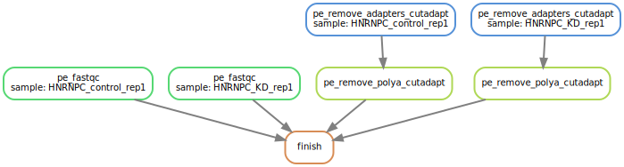

# RNA-Seq pipeline

[Snakemake] workflow for general purpose RNA-Seq library annotation developed
by the [Zavolan lab].

Reads are processed, aligned, quantified and analyzed with state-of-the-art
tools to give meaningful initial insights into various aspects of an RNA-Seq
library while cutting down on hands-on time for bioinformaticians.

The scheme below is a visual representation of an example run of the
workflow:  

> 

## Installation

### Installing Singularity

For improved reproducibility and reusability of the workflow, as well as an
easy means to run it on a high performance computing (HPC) cluster managed,
e.g., by [Slurm], each individual step of the workflow runs in its own
container. Specifically, containers are created out of [Singularity] images
built for each software used within the workflow. As a consequence, running
this workflow has very few individual dependencies. It does, however, require
that Singularity be installed. See the links below for installation
instructions for the most up-to-date (as of writing) as well as for the tested
version (2.6.1) of Singularity:

- [Singularity v3.5](https://sylabs.io/guides/3.5/user-guide/quick_start.html)
- [Singularity v2.6](https://sylabs.io/guides/2.6/user-guide/installation.html)

### Setting up a Snakemake virtual environment

In addition to Singularity, [Snakemake] needs to be installed. We strongly
recommended to do so via a virtual environment. Here we describe the steps
necessary to set up such a virtual environment with a recent version (v4.4+) of
the `conda` package manager. If you prefer to use another solution, such as
`virtualenv`, adapt the steps according to the specific instructions of your
preferred solution.

If you do not have `conda` installed for Python3, we recommend to install the
minimal version (Python and package manager) [Miniconda] (see the link for
installation instructions). Be sure to select the correct version for your
operating system and ensure that you select the Python 3 option.

To create and activate the environment, run:

```bash
conda create -n rnaseq_pipeline \
    -c bioconda \
    -c conda-forge \
    snakemake=5.10.0
conda activate rnaseq_pipeline
```

### Cloning the repository

Traverse to the desired path on your file system, then clone the repository and
move into it with:

```bash
git clone ssh://git@git.scicore.unibas.ch:2222/zavolan_group/pipelines/rnaseqpipeline.git
cd rnaseqpipeline
```

All installation requirements should now be met with.

## Testing the installation

We have prepared several tests to check the integrity of the workflow. The
most important one lets you execute the workflow on a small set of example
input files.

### Run workflow on local machine

Execute the following command to run the test workflow on your local machine:

```bash
bash tests/test_integration_workflow/test.local.sh
```

### Run workflow via Slurm

Execute the following command to run the test workflow on a Slurm-managed HPC.

```bash
bash tests/test_integration_workflow/test.local.sh
```

> **NOTE:** Depending on the configuration of your Slurm installation or if
> using a different workflow manager, you may need to adapt file `cluster.json`
> and the arguments to options `--config` and `--cores` in file
> `test.slurm.sh`, both located in directory `tests/test_integration_workflow`.
> Consult the manual of your workload manager as well as the section of the
> Snakemake manual dealing with [cluster execution].

## Running the workflow on your own samples

1. Assuming that you are currently inside the repository's root directory,
create a directory for your workflow run and traverse inside it with:

    ```bash
    mkdir runs/my_run
    cd runs/my_run
    ```

2. Create empty sample table, workflow configuration and, if necessary, cluster
configuration files:

    ```bash
    touch samples.tsv
    touch config.yaml
    touch cluster.json
    ```

3. Use your editor of choice to manually populate these files with appropriate
values. Have a look at the examples in the `tests/` directory to see what the
files should look like, specifically:

    - [samples.tsv](tests/test_integration_workflow/samples.tsv)
    - [config.yaml](tests/test_integration_workflow/config.yaml)
    - [cluster.json](tests/test_integration_workflow/cluster.json)

4. Create a runner script. Pick one of the following choices for either local
or cluster execution. Before execution of the respective command, you must
replace the data directory placeholders in the argument to the
`--singularity-args` option with a comma-separated list of _all_ directories
containing input data files (samples and any annoation files etc) required for
your run.

    Runner script for _local execution_:

    ```bash
    cat << "EOF" > run.sh
    #!/bin/bash
    mkdir -p logs/local_log
    snakemake \
        --snakefile="../../snakemake/Snakefile" \
        --configfile="config.yaml" \
        --cores=4 \
        --printshellcmds \
        --rerun-incomplete \
        --use-singularity \
        --singularity-args="--bind <data_dir_1>,<data_dir_2>,<data_dir_n>"
    EOF
    ```

    **OR**

    Runner script for _Slurm cluster exection_ (note that you may need
    to modify the arguments to `--cluster` and `--cores` depending on your HPC
    and workload manager configuration):

    ```bash
    cat << "EOF" > run.sh
    #!/bin/bash
    mkdir -p logs/cluster_log
    snakemake \
        --snakefile="../../snakemake/Snakefile" \
        --configfile="config.yaml" \
        --cluster-config="cluster.json" \
        --cluster="sbatch --cpus-per-task={cluster.threads} --mem={cluster.mem} --qos={cluster.queue} --time={cluster.time} --job-name={cluster.name} -o {cluster.out} -p scicore" \
        --cores=256 \
        --printshellcmds \
        --rerun-incomplete \
        --use-singularity \
        --singularity-args="--bind <data_dir_1>,<data_dir_2>,<data_dir_n>"
    EOF
    ```

5. Start your workflow run:

    ```bash
    bash run.sh
    ```

### Configuring workflow runs via LabKey tables

Our lab stores metadata for sequencing samples in a locally deployed [LabKey]
instance. This repository provides two scripts that give programmatic access to
the LabKey data table and convert it to the corresponding workflow inputs
(`samples.tsv` and `config.yaml`), respectively. As such, these scripts largely
automate step 3. of the above instructions. However, as these scripts were
specifically for the needs of our lab, they are likely not portable or, at
least, will require considerable modification for other setups (e.g., different
LabKey table structure).

> **NOTE:** All of the below steps assume that your current working directory
> is the repository's root directory.

1. The scripts have additional dependencies that can be installed with:

    ```bash
    pip install -r scripts/requirements.txt
    ```

2. In order to gain programmatic access to LabKey via its API, a credential
file is required. Create it with the following command after replacing the
placeholder values with your real credentials (talk to your LabKey manager if
you do not have these):

    ```bash
    cat << EOF | ( umask 0377; cat >> ${HOME}/.netrc; )
    machine <remote-instance-of-labkey-server>  
    login <user-email>
    password <user-password>  
    EOF
    ```

3. Run the LabKey API client script:

    ```bash
    python scripts/labkey_api.py <project_name> <labkey_table_nane>
    ```

    > **NOTE:** Right now the script only prints a `pandas` data frame
    > representation of the LabKey table on the screen and manually needs to be
    > saved to a file for the next step. Ultimately the script will produce
    > either a file in table format or will be merged with the following
    > script.

4. Generate the workflow configuration with the following command, after
replacing the placeholders with the appropriate values:

    ```bash
    python scripts scripts/labkey_to_snakemake.py \
        --input_table=<labkey_output_table> \
        --input_dict="scripts/input_dict.tsv" \
        --config_file="runs/my_run/config.yaml" \
        --samples_table="runs/my_run/samples.tsv" \
        --genomes_path=<path_to_annotation_files>
    ```

#### Additional information

The metadata field names in the LabKey instance and those in the parameters
in the Snakemake workflow have different names. A mapping between LabKey
field identifiers and Snakemake parameters is listed below:

Labkey | Snakemake
--- | ---
Entry date | entry_date
Path to FASTQ file(s) | fastq_path
Condition name | condition
Replicate name | replicate_name
End type (PAIRED or SINGLE) | seqmode
Name of Mate1 FASTQ file | fq1
Name of Mate2 FASTQ file | fq2
Direction of Mate1 (SENSE, ANTISENSE or RANDOM) | mate1_direction
Direction of Mate2 (SENSE, ANTISENSE or RANDOM) | mate2_direction
5' adapter of Mate1 | fq1_5p
3' adapter of Mate1 | fq1_3p
5' adapter of Mate2 | fq2_5p
3' adapter of Mate2 | fq2_3p
Fragment length mean | mean
Fragment length SD | sd
Quality control flag (PASSED or FAILED) | quality_control_flag
Checksum of raw Mate1 FASTQ file | mate1_checksum
Checksum of raw Mate2 FASTQ file | mate2_checksum
Name of metadata file | metadata
Name of quality control file for Mate1 | mate1_quality
Name of quality control file for Mate2 | mate2_quality
Organism | organism
Taxon ID | taxon_id
Name of Strain / Isolate / Breed / Ecotype | strain_name
Strain / Isolate / Breed / Ecotype ID | strain_id
Biomaterial provider | biomaterial_provider
Source / tissue name | source_name
Tissue code | tissue_code
Additional tissue description | tissue_description
Genotype short name | genotype_name
Genotype description | genotype_description
Disease short name | disease_name
Disease description | disease_description
Abbreviation for treatment | treatment
Treatment description | treatment_description
Gender | gender
Age | age
Developmental stage | development_stage
Passage number | passage_number
Sample preparation date (YYYY-MM-DD) | sample_prep_date
Prepared by | prepared_by
Documentation | documentation
Name of protocol file | protocol_file
Sequencing date (YYYY-MM-DD) | seq_date
Sequencing instrument | seq_instrument
Library preparation kit | library_kit
Cycles | cycles
Molecule | molecule
Contaminant sequences | contaminant_seqs

[cluster execution]: <https://snakemake.readthedocs.io/en/stable/executing/cluster-cloud.html#cluster-execution>
[LabKey]: <https://www.labkey.com/>
[Miniconda]: <https://docs.conda.io/en/latest/miniconda.html>
[Snakemake]: <https://snakemake.readthedocs.io/en/stable/>
[Singularity]: <https://sylabs.io/singularity/>
[Slurm]: <https://slurm.schedmd.com/documentation.html>
[Zavolan lab]: <https://www.biozentrum.unibas.ch/research/researchgroups/overview/unit/zavolan/research-group-mihaela-zavolan/>
