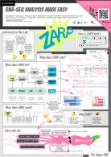

<figure markdown>
  { width="384" }
</figure>

# _ZARP_

**Welcome to the _ZARP_ documentation pages!**

_ZARP_ is a generic RNA-Seq analysis workflow that allows users to process and
analyze Illumina short-read sequencing libraries with minimum effort. Better
yet: With our companion [**_ZARP-cli_**][zarp-cli] command line interface, you
can start _ZARP_ runs with the simplest and most intuitive commands.

_RNA-seq analysis doesn't get simpler than that!_

The workflow is developed in [Snakemake][snakemake], a widely used workflow
management system in the bioinformatics community. _ZARP_ will pre-process,
align and quantify your single- or paired-end stranded bulk RNA-seq sequencing
libraries with publicly available state-of-the-art bioinformatics tools.
_ZARP_'s browser-based rich reports and visualizations will give you meaningful
initial insights in the quality and composition of your sequencing experiments
- fast and simple. Whether you are an experimentalist struggling with large
scale data analysis or an experienced bioinformatician, when there's RNA-seq
data to analyze, just _zarp 'em_!

## How does it work?

_ZARP_ requires [Conda][conda] to install the basic dependencies. Each
individual step of the workflow runs either in its own [Apptainer][apptainer]
container or in its own [Conda][conda] virtual environment.

Once the installation is complete, you fill in a [`config.yaml`][config-file]
file with parameters and a [`samples.tsv`][sample-table] file with
sample-specific information. You can easily trigger _ZARP_ by making a call to
Snakemake with the appropriate parameters.

_ZARP_ can be executed in different systems or High Performance Computing (HPC)
clusters. _ZARP_ generates multiple output files that help you quality control
(QC) your data and proceed with downstream analyses. Apart from running the
main _ZARP_ workflow, we also provide you with two auxiliary workflows for
fetching sequencing libraries from the [Sequence Read Archive (SRA)][sra] and
for inferring missing sample metadata straight from the data itself (both of
which are integrated in [_ZARP-cli_][zarp-cli] for your convenience).

## How to cite

If you use _ZARP_ in your work, please kindly cite the following article:

**ZARP: A user-friendly and versatile RNA-seq analysis workflow**  
_Maria Katsantoni, Foivos Gypas, Christina J. Herrmann, Dominik Burri, Maciej
Bak, Paula Iborra, Krish Agarwal, Meric Ataman, Máté Balajti, Noè Pozzan, Niels
Schlusser, Youngbin Moon, Aleksei Mironov, Anastasiya Börsch, Mihaela Zavolan,
Alexander Kanitz_  
F1000Research 2024, 13:533  
<https://doi.org/10.12688/f1000research.149237.1>

## Info materials

### Poster

  

## Reach out

There are several ways to get in touch with us:

- For _ZARP_ usage questions, please use the [_ZARP_ Q&A forum][zarp-qa]
  (requires [GitHub registration][github-signup]).
- For feature suggestions and bug reports, please use either the
  [_ZARP_][zarp-issue-tracker] or [_ZARP-cli_][zarp-cli-issue-tracker] issue
  tracker (requires [GitHub registration][github-signup]).
- For any other requests, please reach out to us via [email][contact].

!!! info "Contributors welcome!"

    Open source contributors are always welcome, for [_ZARP_][zarp],
    [_ZARP-cli_][zarp-cli] or any other of the [Zavolab
    projects][zavolab-gh]. Simply reach out by [email][contact] to schedule
    an onboarding call.

## Acknowledgements

